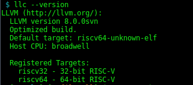
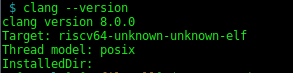
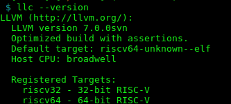
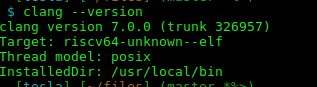

# RISC-V LLVM 

Source: [oficial riscv-tools](https://github.com/riscv/riscv-tools) and [sifive riscv-llvm](https://github.com/sifive/riscv-llvm)

This repository adds support for various aspects of the RISC-V instruction set to the Clang C/C++ compiler band LLVM back end.

You will need the RISC-V GCC toolchain. If you don't have RISC-V hardware then you will want to have QEMU to run your programs.

The following bash commands have been tested on Debian 9 and Ubuntu 18.04 LTS.

By default, clang is generating rv32imac/rv64imac code but you can override this, and in particular if you have floating point hardware you can add "-march=rv32gc" (or rv64gc) to the clang command line to get FPU instructions with a soft float ABI.

### Requirements

You need install programs before use the tools

```bash
$ sudo apt-get update
$ sudo apt-get install binutils build-essential libtool texinfo gzip zip unzip patchutils curl git make cmake ninja-build automake bison flex gperf grep sed gawk python bc zlib1g-dev libexpat1-dev libmpc-dev libglib2.0-dev libfdt-dev libpixman-1-dev
```

Now you need create a folder to work

```bash
$ mkdir riscv && cd riscv
$ mkdir toolchain
$ export PATH=`pwd`/toolchain/bin:$PATH
```

Alternative you can create folder in ``/opt/riscv`` 

Prepare the riscv-toolchain

```bash
$ git clone --recursive https://github.com/riscv/riscv-gnu-toolchain
$ pushd riscv-gnu-toolchain
$ ./configure --prefix=`pwd`/../toolchain --enable-multilib
# Installation (Newlib)
$ make -j`nproc`
# Installation (Linux)
$ make linux -j`nproc`
$ popd
```

LLVM SiFive version

Change FolderLocation to the folder location of the toolchain.

```bash
$ git clone https://github.com/sifive/riscv-llvm
$ pushd riscv-llvm
$ mkdir build && cd build
$ cmake -G Ninja -DCMAKE_BUILD_TYPE="Release" \
  -DBUILD_SHARED_LIBS=True -DLLVM_USE_SPLIT_DWARF=True \
  -DCMAKE_INSTALL_PREFIX="FolderLocation/toolchain" \
  -DLLVM_OPTIMIZED_TABLEGEN=True -DLLVM_BUILD_TESTS=False \
  -DDEFAULT_SYSROOT="FolderLocation/toolchain/riscv64-unknown-elf" \
  -DLLVM_DEFAULT_TARGET_TRIPLE="riscv64-unknown-elf" \
  -DLLVM_TARGETS_TO_BUILD="" -DLLVM_EXPERIMENTAL_TARGETS_TO_BUILD="RISCV" \
  ../llvm
$ cmake --build . --target install
$ popd
```

Sanity test your new RISC-V LLVM

```bash
$ echo -e '#include <stdio.h>\n int main(void) { printf("Hello world!\\n"); return 0; }' > hello.c

# 32 bit
$ clang -O -c hello.c --target=riscv32
$ riscv64-unknown-elf-gcc hello.o -o hello -march=rv32imac -mabi=ilp32
$ qemu-riscv32 hello

# 64 bit
$ clang -O -c hello.c
$ riscv64-unknown-elf-gcc hello.o -o hello -march=rv64imac -mabi=lp64
$ qemu-riscv64 hello
```

If you want can test the versions of Clang and LLVM with `` clang --version`` and ``llc --version``  

 


LLVM lowRISC version

```bash
$ export RISCV=/home/fgranados/Downloads/riscv/toolchain
$ export RISCV_source=/home/fgranados/Downloads/riscv
$ export CC=/usr/local/bin/gcc-$version
$ export CXX=/usr/local/bin/g++-$version

# patch file RISCV64_Support.patch in source path folder:
$ wget https://github.com/lowRISC/riscv-llvm/files/2241256/RISCV64_Support.patch.txt -O RISCV64_Support.patch

$ git clone https://github.com/lowRISC/riscv-llvm.git lowriscv-llvm
# Check the most recent commit on this repo to ensure this is correct
$ cd lowriscv-llvm && export REV=326957
$ svn co http://llvm.org/svn/llvm-project/llvm/trunk@$REV llvm && cd llvm/tools && svn co http://llvm.org/svn/llvm-project/cfe/trunk@$REV clang && cd ..
$ for P in $RISCV_source/lowriscv-llvm/*.patch; do patch -p1 < $P; done
$ for P in $RISCV_source/lowriscv-llvm/clang/*.patch; do patch -d tools/clang -p1 < $P; done
$ patch tools/clang/lib/Driver/ToolChains/Gnu.cpp < $RISCV_source/RISCV64_Support.patch
$ cd $RISCV_source/lowriscv-llvm
$ mkdir build && cd build	
$ cmake -G Ninja -DCMAKE_BUILD_TYPE="Release" \
-DBUILD_SHARED_LIBS=True -DLLVM_USE_SPLIT_DWARF=True \
-DLLVM_OPTIMIZED_TABLEGEN=True \
-DLLVM_BUILD_TESTS=True \
-DCMAKE_INSTALL_PREFIX="$RISCV/" \
-DDEFAULT_SYSROOT="$RISCV/riscv64-unknown-elf" \
-DLLVM_DEFAULT_TARGET_TRIPLE="riscv64-unknown-elf" \
-DLLVM_TARGETS_TO_BUILD="" -DLLVM_EXPERIMENTAL_TARGETS_TO_BUILD="RISCV" \
../llvm
$ cmake --build . --target install
```

Export environment variable :

```bash
 $ export PATH=/$RISCV/bin:$PATH
```

If you want can test the versions of Clang and LLVM with `` clang --version`` and ``llc --version``  

   


### Generate IR LLVM 

Export PATH where the toolchain are installed:

```bash
$ export PATH=/directory_to_install/bin:$PATH
```

1. Clang compile, the last number corresponds to the optimization level, it can take a value of 0,1,2 or 3.

   For riscv32 use the flag ``--target=riscv32``, for riscv64 is not necessary.

   To generate .ll file add ``-emit-llvm``

   ```bash
   $ clang-version -S -emit-llvm file.c -O1
   $ clang-version file.c -o output
   ```

2. Run the program

   ```bash
   $ ./output
   ```

3. Generate assembly (generates a optimised.s file)

   ```bash
   $ llc-version file.ll -o file.s
   ```

4. Generate the binary for RISC-V

   ```bash
   $ riscv64-unknown-elf-gcc file.o -o output
   ```


## Changes in LLVM IR 

Exists changes in LLVM IR, but these changes are generated by...


Using the toolchain riscv64-unknown-elf-gcc (SiFive GCC 8.2.0-2019.05.3) 


For this example use a simple loop:

```c
#include <stdio.h>
int main(){
    int sum = 0;
    for(int i = 0; i < 100; i++){
        sum += i;
        }
    printf("sum: %d\n", sum);
    return 1;
}
```


| LLVM IR generated with gcc-8                                 | LLVM and Clang X                                             |
| :----------------------------------------------------------- | :----------------------------------------------------------- |
| ; Function Attrs: nounwind <br/>define i32 @main() #0 {<br/>  %1 = alloca i32, align 4<br/>  %2 = alloca i32, align 4<br/>  %3 = alloca i32, align 4<br/>  store i32 0, i32* %1, align 4<br/>  store i32 0, i32* %2, align 4<br/>  store i32 0, i32* %3, align 4<br/>  br label %4 | ; Function Attrs: nounwind<br/>define i32 @main() #0 {<br/>%retval = alloca i32, align 4<br/>%sum = alloca i32, align 4<br/>%i = alloca i32, align 4<br/>store i32 0, i32* %retval<br/>store i32 0, i32* %sum, align 4 <br/>store i32 0, i32* %i, align 4 <br/>br label %for.cond |
| ; <label>:4:           ; preds = %11, %0<br/> %5 = load i32, i32* %3, align 4<br/> %6 = icmp slt i32 %5, 100<br/> br i1 %6, label %7, label %14 | for.cond:        ; preds = %for.inc, %entry<br/>%0 = load i32, i32* %i, align 4<br/>%cmp = icmp slt i32 %0, 100 <br/>br i1 %cmp, label %for.body, label %for.end |
| ; <label>:7:              ; preds = %4<br/>  %8 = load i32, i32* %3, align 4<br/>  %9 = load i32, i32* %2, align 4<br/>  %10 = add nsw i32 %9, %8<br/>  store i32 %10, i32* %2, align 4<br/>  br label %11 | for.body:             ; preds = %for.cond  <br/>%1 = load i32, i32* %i, align 4<br/>%2 = load i32, i32* %sum, align 4<br/>%add = add nsw i32 %2, %1<br/>store i32 %add, i32* %sum, align 4<br/>br label %for.inc |
| ; <label>:11:              ; preds = %7<br/>  %12 = load i32, i32* %3, align 4<br/>  %13 = add nsw i32 %12, 1<br/>  store i32 %13, i32* %3, align 4<br/>  br label %4 | for.inc:                ; preds = %for.body<br/>%3 = load i32, i32* %i, align 4<br/>%inc = add nsw i32 %3, 1<br/>store i32 %inc, i32* %i, align 4<br/>br label %for.cond |
| ; <label>:14:                 ; preds = %4<br/> %15 = load i32, i32* %2, align 4<br/> %16 = call signext i32 (i8*, ...) i32 signext %15<br/> ret i32 1<br/>} | for.end:                 ; preds = %for.cond<br/>%4 = load i32, i32* %sum, align 4 <br/>%call = call i32 (i8*, …) i32 %4)<br/>ret i32 1<br/>} |

